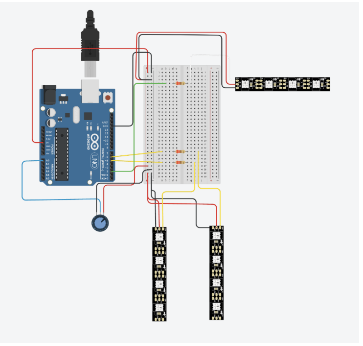

# Viva  
Kode til prosjektet vi har gjennomført i IN1060

## Om prosjektet

Vi har utviklet en brukervennlig nakkelampe som gir fleksibelt og justerbart lys til eldre brukere med ulike utfordringer. Lampen er laget med utgangspunkt i bruksorientert design, og er utviklet for, med og av brukere. Målet har vært å gjøre hverdagen enklere for brukerne våre ved å tilby bedre lys til aktiviteter som lesing og håndarbeid.

## Teknisk løsning

Lampen består av:
- **LED-striper** på hver side for jevnt og justerbart lys
- **Batteriindikator** som viser status med fargene grønn, gul og rød (simulert)
- **Dimmehjul** for enkel regulering av lysstyrken
- **Fleksibel base** av hårruller og ståltråd for enkel vinkling
- **Mykt bomullsstoff** i mørk blåfarge for komfort og diskret utseende
- **Arduino Uno** for styring av elektronikken

## Kodeoversikt

Koden er utviklet for å styre LED-stripene og batteriindikatoren via et potensiometer, med funksjoner for jevn overgang mellom lys og av (fadeIn/fadeOut). Batterinivået simuleres i koden, slik at brukeren kan se når lampen burde lades.

**Viktige funksjoner:**
- `setup()`: Initialiserer LED-striper
- `loop()`: Leser dimmer, styrer lysstyrke og simulerer batterinivå
- `fadeIn(int maxBrightness)`: Øker gradvis lysstyrken
- `fadeOut(int currentBrightness)`: Dimmer gradvis ned lyset

## Kretsdiagram
Nedenfor vises kretsdiagrammet for nakkelampen. Diagrammet illustrerer hvordan LED-stripene (for lys og batteriindikator) og dimmehjulet (potensiometer) er koblet til Arduinoen via relevante porter. 

## Dokumentasjon

Se den tekniske rapporten for detaljer om designprosessen, brukermedvirkning, bruksscenarioer og evaluering.

## Video

Se videoen som viser bruksscenarier:  
[YouTube: Viva](https://www.youtube.com/watch?v=Q6A2B7yr904 )

## Referanser

- **Adafruit NeoPixel Library**  
  [GitHub: Adafruit NeoPixel](https://github.com/adafruit/Adafruit_NeoPixel)
